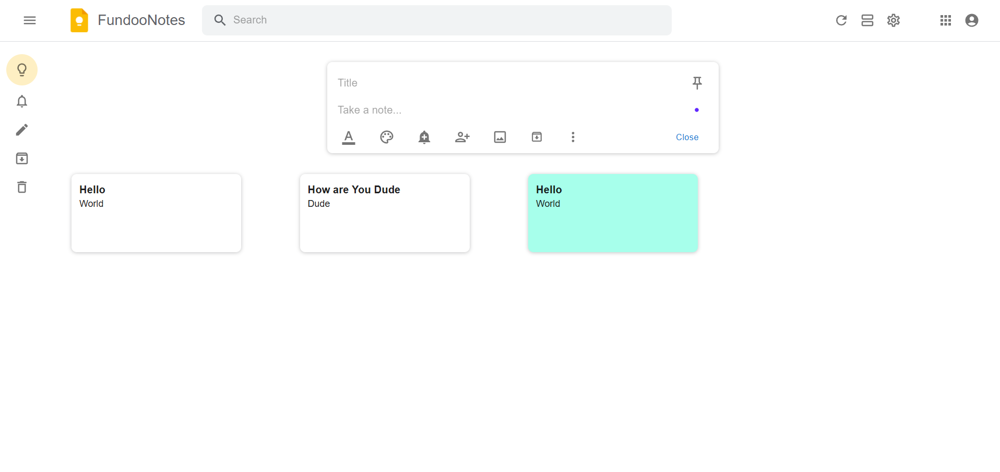

# 📝 FundooNotes

FundooNotes is a **full‑stack note‑taking web application** inspired by Google Keep. It allows users to create, manage, organize, and customize notes with features like color updates, archiving, deletion, and real‑time UI updates.

---

## 🚀 Features

* 🔐 User Authentication (Login / Signup)
* 📝 Create, Edit & Delete Notes
* 🎨 Change Note Colors (Optimistic UI update)
* 📌 Pin & Unpin Notes
* 🗄️ Archive / Unarchive Notes
* 🗑️ Trash Notes (Soft delete)
* 📋 Grid View & List View
* ⚡ Fast and responsive UI
* 🌐 REST API integration

---

## 🛠️ Tech Stack

### Frontend

* React.js
* Material UI (MUI)
* Context API (Global State Management)
* Axios

### Backend

* json-server

---

## 📂 Project Structure

```
FundooNotes/
│
├── client/                 # React Frontend
│   ├── components/
│   ├── pages/
│   ├── context/
│   ├── services/
│   └── App.js
│
├── server/                 # Backend
│   ├── controllers/
│   ├── models/
│   ├── routes/
│   ├── middleware/
│   └── server.js
│
└── README.md
```

---

## ⚙️ Installation & Setup

### 1️⃣ Clone the Repository

```bash
git clone https://github.com/Divyansh230/FundooNotes.git
cd fundoonotes
```

---

### 2️⃣ Backend Setup


Run backend server:

```bash
json-server --watch db.json
```

---

### 3️⃣ Frontend Setup

```bash
cd client
npm install
npm start
```

Frontend will run on:

```
http://localhost:3000
```

Backend will run on:

```
http://localhost:5000
```

---

## 🔁 API Flow Example

* Notes fetched using `GET /notes`
* Create note: `POST /notes`
* Update note color: `PUT /notes/:id`
* Archive note: `PUT /notes/archive/:id`
* Delete note: `DELETE /notes/:id`

Optimistic UI is used — UI updates first, API sync happens afterward.

---

## 📸 Screenshots

> 

---

## 🧠 Key Concepts Used

* React Hooks (`useState`, `useEffect`, `useContext`)
* Optimistic UI updates
* RESTful APIs
* MongoDB schema design
* Component‑based architecture

---

## 👨‍💻 Developer

**Divyansh Singh**
Full Stack Developer | MERN Stack | AI Enthusiast

---

## ⭐ Future Enhancements

* 🔍 Search Notes
* 🏷️ Labels / Tags
* 🤝 Collaboration
* ☁️ Cloud sync
* 📱 Mobile responsiveness improvement

---

## 📄 License

This project is licensed under the MIT License.

---

> Made with ❤️ by Divyansh Singh
